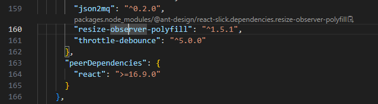
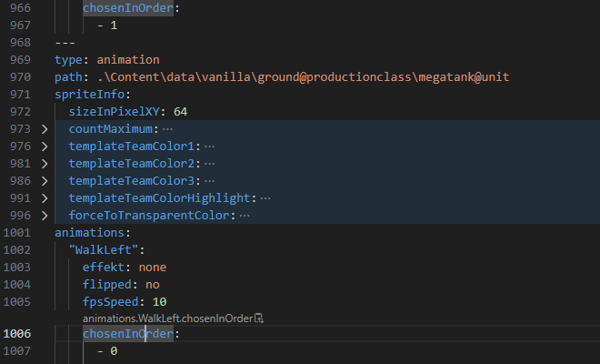

# 📍 JSON+YAML+Path (copy paths inline)

**Never get lost in nested data again.** This extension provides a real-time "breadcrumb" directly above your cursor, allowing you to identify and copy property paths in JSON and YAML files instantly.

---

## ✨ Features

- **⚡ Real-Time Path Detection**: As you move your cursor, the CodeLens updates instantly to show exactly where you are in the data structure.
- **📋 One-Click Copy**: Click the path label in your editor to copy the full dot-notation path (e.g., `server.config.ports[0].internal`) to your clipboard.
- **📄 Multi-Format Support**:
  - **JSON**: Full support for `.json` and `.jsonc` (JSON with comments).
  - **YAML**: Full support for `.yaml` and `.yml`, including multi-document files (separated by `---`).
- **📎 Array Awareness**: Automatically calculates and formats array indices as `[0]`, `[1]`, etc.

---

## 🚀 How to Use

1.  Open any **JSON** or **YAML** file.
2.  Click on any property or value.
3.  Look at the line **directly above your cursor**—the path will appear via CodeLens.
4.  **Click the path text** (next to the 📎 icon) to instantly copy it to your clipboard.

### JSON Example

### YAML Example

## 

## 🛠 Supported Languages

| Language | File Extensions                            |
| :------- | :----------------------------------------- |
| **JSON** | `.json`, `.jsonc`, `.tsconfig`, `.bowerrc` |
| **YAML** | `.yaml`, `.yml`                            |

---

## ⚙️ Extension Settings

This extension is designed to be "zero-config." However, ensure that **CodeLens** is enabled in your VS Code settings:

- `editor.codeLens`: Must be set to `true` (default).

---

## 📝 Release Notes

### 0.1.0

- Initial release.
- Added support for JSON/JSONC and YAML.
- Implemented cursor-tracking CodeLens provider.
- Added "Click-to-Copy" functionality with clipboard integration.

---

## 🤝 Contributing

Found a bug or have a feature request? Please open an issue on the [GitHub Repository](https://github.com/rufreakde/JSON-YAML-Path.git).

**Enjoying the extension?** Consider leaving a review on the Visual Studio Marketplace!
